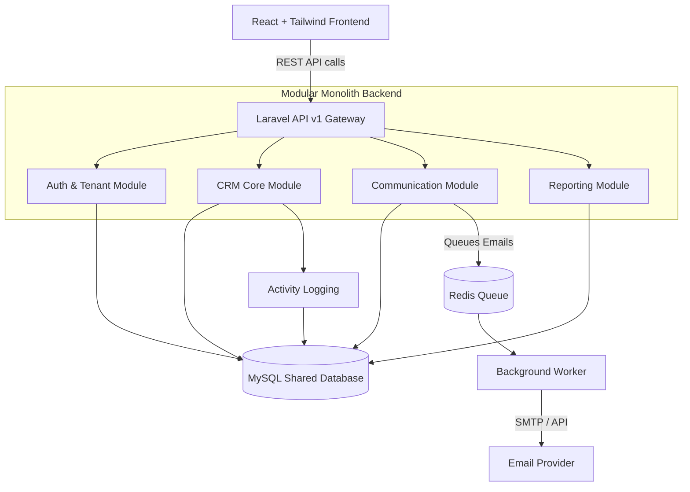
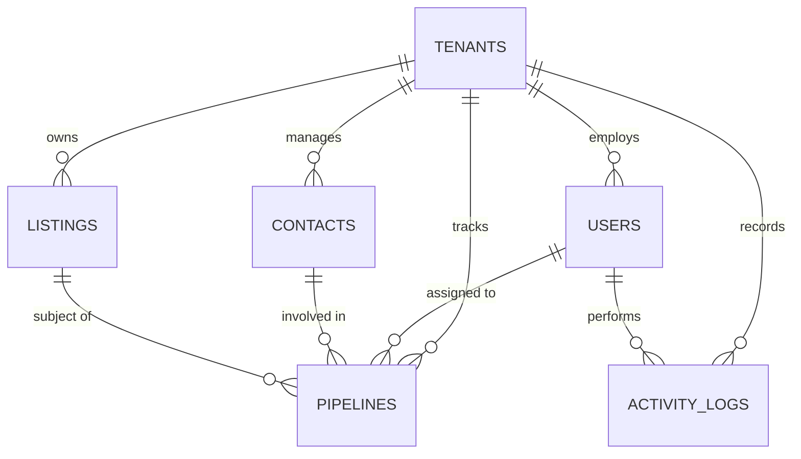

# PRD — Project Requirements Document

## 1. Overview
**Lifely** is a modern, multi-tenant Customer Relationship Management (CRM) SaaS application aimed at property offices and real estate agents. Currently, many agents suffer through the pain of manually tracking leads, managing sales pipelines on disparate Excel spreadsheets, and sending individual emails or SMS messages. Lifely solves this by centralizing listings, contacts, and communication into a single, intuitive platform that heavily automates the workflow and saves significant time. 

Conceived as a production-grade portfolio project, Lifely focuses on engineering clarity, clean domain separation, and scalability over sheer feature volume. It demonstrates how a robust, modular monolith can cleanly support multiple offices (tenants) under a shared database, with distinct domains handling authentication, CRM workflows, bulk communication, and reporting.

## 2. Requirements
- **Multi-Tenant Architecture:** The system must securely host multiple property offices within a shared database and shared schema, using a `tenant_id` to strictly separate office data.
- **API-First Design:** Complete separation between the React frontend and the Laravel backend API to support future scalability and additional client applications.
- **Queue and Background Processing:** Heavy tasks, specifically bulk email sending, must be processed asynchronously using queues (Redis) with robust retry handling.
- **Role-Based Access Control (RBAC):** Distinct permission levels (e.g., Office Admin vs. Simple Agent) controlling access to office settings, user management, and contact visibility.
- **Design System:** A calm, sky-blue inspired productivity interface using Tailwind CSS and Shadcn.
  - Primary: `#0EA5E9` | Background: `#F8FAFC` | Main Text: `#0F172A`
- **Scope Limits:** Do not include complex document management, complex marketing generators, SMS functionality, or newsletter ecosystems to keep the core clean and maintainable.

## 3. Core Features
- **Office and Member Management:** Onboard property offices (tenants) and manage the agents/staff associated with them.
- **Contact & Lead Management:** Add, update, and comprehensively track customer details and their history with the agency.
- **Pipeline Tracking:** Visual sales steps that allow agents to manage deals from initial contact to successful closing. (Creating a sales task serves as the user's initial "Aha!" moment).
- **Listings Management:** A streamlined database for tracking property listings available within the agency.
- **Bulk Email Communication:** Ability to select multiple leads and send targeted bulk emails asynchronously.
- **Activity & Audit Logging:** A system-wide tracking mechanism that logs user actions for accountability and historical reference.
- **Sales Reporting Dashboard:** A clean visual overview showing pipeline performance, new sales leads (the primary retention trigger), and general office health.

## 4. Project Structure
The repository follows a clean, decoupled layout with the root directory named `lifely`. This structure separates the frontend and backend services while maintaining shared configuration, infrastructure definitions, and documentation.

```
lifely/
├── frontend/
├── backend-laravel/
├── docker/
├── docker-compose.yml
├── .env.example
├── README.md
└── docs/
```

## 5. User Flow
1. **Login & Authentication:** The user (Property Agent) logs into the system using their credentials. The system identifies their assigned `tenant_id`.
2. **Dashboard Overview:** The user lands on their tailored dashboard displaying new leads, pending sales tasks, and a quick performance report.
3. **Adding a Lead:** The user navigates to the Contacts module to input a new potential client’s details.
4. **Pipeline & Task Creation:** The user links the new lead to a specific property listing, places them into the first stage of the Sales Pipeline, and creates a "Follow-up" task (the first-try win).
5. **Bulk Communication:** Later, the user selects several leads in a similar pipeline stage and composes a bulk update email.
6. **Background Processing:** The user hits "Send" and immediately returns to their workflow while the system queues and safely dispatches the bulk emails in the background.

## 6. Architecture
Lifely uses a **Modular Monolith** architecture with distinct domains to prepare for future microservice extraction. The frontend and backend are completely decoupled.



## 7. Database Schema
To support multi-tenancy, almost all tables include a `tenant_id` to ensure strict data isolation at the application query level.

* **tenants**: Stores office/agency information.
  * `id` (PK, UUID), `name` (String), `created_at` (Timestamp)
* **users**: Stores agent and admin credentials.
  * `id` (PK, UUID), `tenant_id` (FK), `role` (String), `name` (String), `email` (String), `password_hash` (String)
* **contacts**: Customer and lead details.
  * `id` (PK, UUID), `tenant_id` (FK), `first_name` (String), `last_name` (String), `email` (String), `phone` (String), `status` (String)
* **listings**: Property data available for sale/rent.
  * `id` (PK, UUID), `tenant_id` (FK), `title` (String), `address` (Text), `price` (Decimal), `status` (String)
* **pipelines**: Sales deals and their current status steps.
  * `id` (PK, UUID), `tenant_id` (FK), `contact_id` (FK), `listing_id` (FK), `user_id` (FK), `stage` (String), `value` (Decimal)
* **activity_logs**: Audit trails for system actions.
  * `id` (PK, UUID), `tenant_id` (FK), `user_id` (FK), `action_type` (String), `description` (Text), `created_at` (Timestamp)



## 8. Tech Stack
Based on the explicit project constraints focused on production-grade engineering and specific toolchains, the chosen technology stack is:

* **Frontend:**
  * **Framework:** React
  * **Styling:** Tailwind CSS
  * **Component Library:** Shadcn/ui
  * **Typography:** Inter font
* **Backend:**
  * **Framework:** Laravel (PHP) acting as an API (v1) module
  * **Architecture Style:** API-first, Modular Monolith
* **Infrastructure & Database:**
  * **Database:** MySQL
  * **Caching & Queue:** Redis (handling bulk email queues and retry processing)
  * **Containerization:** Docker (for seamless, production-accurate local development and deployment)